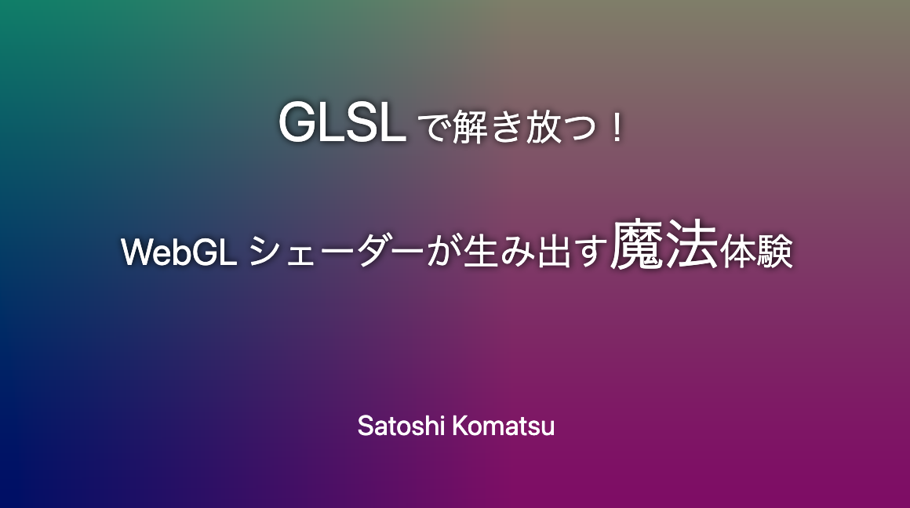

# GLSL で解き放つ！WebGL シェーダーが生み出す魔法体験

「フロントエンドカンファレンス北海道 2025」で発表したスライドのリポジトリです。




### プロポーザル

https://fortee.jp/frontend-conf-hokkaido-2025/proposal/fbbe706c-7ac5-4e7a-8efa-35fa68132a3a

### スライド

https://satoshi7190.github.io/shader-slide/

### スライドの閲覧方法

画面下にマウスカーソルを持っていくと、コントロールボタンが表示されるので、そこからスライドを操作できます。キー操作でも可能です。


### 開発環境起動

```sh
pnpm install
pnpm run dev
```

※ スライドは画面の最大幅で16:9の比率で維持されるため、ブラウザ画面をフルスクリーンにしてご覧ください
